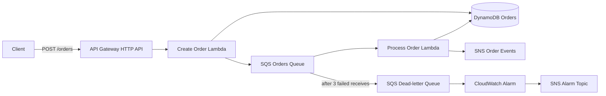

# AWS Serverless Order Processing (Fixed)

A complete, portfolio-ready serverless order pipeline built with AWS SAM and Python. A client submits an order to API Gateway, the first Lambda stores it in DynamoDB and queues it, and the second Lambda processes it asynchronously and publishes an event to SNS.

## Architecture



The API returns `202 Accepted` after durable storage and queuing. SQS invokes the processor with partial-batch failure reporting. Duplicate deliveries do not process an order twice because the DynamoDB update requires its status to still be `PENDING`.

## Repository layout

```text
.
├── src/create_order/app.py       # API request validation, DynamoDB write, SQS send
├── src/process_order/app.py      # Conditional update and SNS event
├── iam/                          # Standalone least-privilege policy examples
├── events/create-order.json      # Local invocation event
├── tests/test_handlers.py        # Unit tests
├── template.yaml                 # Complete SAM infrastructure
└── samconfig.toml.example        # Deployment configuration example
```

## Prerequisites

- An AWS account and credentials configured with permission to deploy CloudFormation/IAM resources
- AWS CLI v2
- AWS SAM CLI
- Python 3.12 (for local tests)
- Docker (only required for `sam local`)

Check the tools:

```bash
aws sts get-caller-identity
sam --version
python --version
```

## Deploy

Choose the AWS Region where you want the stack. Then run:

```bash
sam validate --lint
sam build
sam deploy --guided
```

Suggested guided-deployment answers:

- Stack name: `aws-serverless-order-processing-fixed`
- Region: your preferred AWS Region
- Parameter `AlarmEmail`: an email address, or leave blank to skip the email subscription
- Allow SAM to create IAM roles: `Y`
- Save arguments to configuration: `Y`

If an alarm email was supplied, confirm the AWS SNS subscription email. Find the deployed endpoint with:

```bash
aws cloudformation describe-stacks \
  --stack-name aws-serverless-order-processing-fixed \
  --query "Stacks[0].Outputs[?OutputKey=='OrdersEndpoint'].OutputValue" \
  --output text
```

## Environment variables

SAM sets these automatically using resource references; do not commit account-specific values.

| Function | Variable | Value |
|---|---|---|
| Create Order | `ORDERS_TABLE` | DynamoDB table name |
| Create Order | `ORDERS_QUEUE_URL` | SQS queue URL |
| Process Order | `ORDERS_TABLE` | DynamoDB table name |
| Process Order | `ORDER_EVENTS_TOPIC_ARN` | SNS topic ARN |

For a manual console deployment, create the same variables in each Lambda configuration. The example policies in `iam/` use placeholders (`REGION`, `ACCOUNT_ID`, and resource names) that must be replaced. The SAM template creates scoped execution roles automatically, including basic log permissions and the SQS event-source permissions required by Lambda.

## API request

`POST /orders`

```json
{
  "customerId": "customer-123",
  "items": [
    {"productId": "sku-001", "quantity": 2},
    {"productId": "sku-002", "quantity": 1}
  ]
}
```

Example response:

```json
{"orderId":"generated-uuid","status":"PENDING"}
```

Call the deployed endpoint:

```bash
curl -X POST "$ORDERS_ENDPOINT" \
  -H "Content-Type: application/json" \
  -d '{"customerId":"customer-123","items":[{"productId":"sku-001","quantity":2}]}'
```

## Test

Run unit tests in a virtual environment:

```bash
python -m venv .venv
# macOS/Linux: source .venv/bin/activate
# Windows PowerShell: .venv\Scripts\Activate.ps1
python -m pip install -r requirements-dev.txt
pytest -q
```

Build and invoke the create function locally (Docker required):

```bash
sam build
sam local invoke CreateOrderFunction --event events/create-order.json \
  --env-vars env.local.json
```

For local invocation only, create an untracked `env.local.json` containing reachable test resources:

```json
{
  "CreateOrderFunction": {
    "ORDERS_TABLE": "your-test-table",
    "ORDERS_QUEUE_URL": "https://sqs.REGION.amazonaws.com/ACCOUNT_ID/your-test-queue"
  }
}
```

After deployment, send the API request and verify that the item changes from `PENDING` to `PROCESSED`. Review logs with:

```bash
sam logs -n CreateOrderFunction --stack-name aws-serverless-order-processing-fixed --tail
sam logs -n ProcessOrderFunction --stack-name aws-serverless-order-processing-fixed --tail
```

To test the DLQ alarm in a non-production stack, temporarily make the processor fail, deploy it, send a test order, and wait for three receives. Restore the code immediately afterward. Never use this method in production.

## Failure behavior

- Invalid input returns HTTP `400`.
- A service failure is logged and Lambda returns an API `5xx` response.
- Processing failures are retried by SQS; only failed records in a batch are retried.
- After three failed receives, a message moves to the encrypted DLQ.
- The CloudWatch alarm enters `ALARM` when at least one message is visible in the DLQ and publishes to the alarm SNS topic.

## Security notes

- DynamoDB, SQS, and SNS use encryption at rest.
- SAM policy templates scope access to the resources in this stack.
- The JSON documents in `iam/` show explicit least-privilege alternatives.
- The sample API has no authentication so it is easy to demonstrate. Before production, add a JWT authorizer or IAM authorization, request throttling, input-size limits, and AWS WAF as appropriate.
- Avoid customer secrets or payment information in order payloads and logs.

## Cleanup

Empty queues are removed with the stack. Delete all deployed resources with:

```bash
sam delete --stack-name aws-serverless-order-processing-fixed
```

Confirm deletion when prompted. If deployment created a managed SAM packaging bucket, `sam delete` offers to remove the generated artifacts. Verify the stack is gone:

```bash
aws cloudformation describe-stacks --stack-name aws-serverless-order-processing-fixed
```

An expected `ValidationError` stating that the stack does not exist confirms cleanup.

## License

MIT
