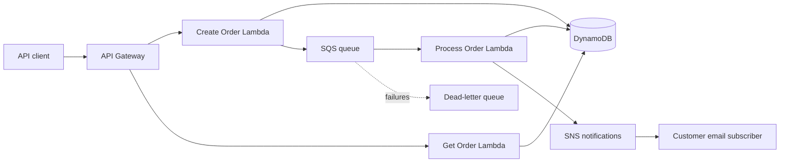

# AWS Serverless Order Processing System

An event-driven serverless order-processing prototype built with AWS Lambda, Amazon API Gateway, DynamoDB, SQS, and SNS. It validates incoming orders, processes them asynchronously, updates their status, and sends customer completion notifications.

> CV summary: Developed a serverless order-processing prototype using AWS Lambda, DynamoDB, SQS, and SNS. Implemented order validation, asynchronous processing, status updates, and customer notifications. Documented API testing and AWS resource cleanup procedures.

## Architecture



See the [detailed architecture](docs/architecture.md).

## API

| Method | Path | Purpose | Success |
|---|---|---|---|
| `POST` | `/orders` | Validate and accept a new order | `202` |
| `GET` | `/orders/{order_id}` | Retrieve the latest order status | `200` |

Example request:

```json
{
  "customer_email": "customer@example.com",
  "items": [
    {"product_id": "AWS-BOOK-01", "quantity": 2, "unit_price": 29.99}
  ]
}
```

## AWS services

- **API Gateway** exposes the REST endpoints.
- **Lambda** validates, retrieves, and asynchronously processes orders.
- **DynamoDB** stores orders and status updates with on-demand capacity and encryption.
- **SQS** decouples order acceptance from processing and retries transient failures.
- **SNS** publishes completion notifications to an optional confirmed email subscriber.
- **IAM** provides a separate least-privilege execution role for each Lambda function.
- **CloudWatch and X-Ray** provide logs, an API error alarm, metrics, and tracing.
- **AWS SAM** defines and deploys the complete application as infrastructure as code.

## Quick start

```bash
python -m pip install -r requirements-dev.txt
pytest
sam validate --lint
sam build
sam deploy --guided
```

Full instructions:

- [Deployment guide](docs/deployment.md)
- [API testing and sample requests](docs/api-testing.md)
- [AWS resource cleanup](docs/cleanup.md)

## Project structure

```text
.
|-- template.yaml
|-- samconfig.toml
|-- src/
|   |-- create_order/app.py
|   |-- get_order/app.py
|   `-- process_order/app.py
|-- tests/
|-- events/
|-- docs/
|-- requirements-dev.txt
`-- pytest.ini
```

## Order states

```text
PENDING -> PROCESSING -> COMPLETED
```

Failed SQS records are retried. After three failed receives, SQS moves the message to the dead-letter queue for investigation.

## Cost and security notes

The project uses serverless, pay-per-use services and DynamoDB on-demand billing, but deploying it can incur AWS charges. Delete the stack after testing. The API is intentionally unauthenticated for portfolio demonstration; add Amazon Cognito or an API Gateway authorizer before exposing a production system.

## License

MIT
