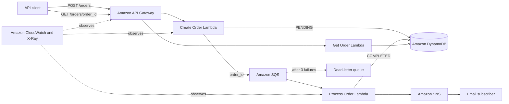

# Architecture

## Request lifecycle

1. API Gateway invokes `CreateOrderFunction` for `POST /orders`.
2. The function validates the email, products, quantities, and prices.
3. It stores the order in DynamoDB with `PENDING` status and sends its ID to SQS.
4. SQS invokes `ProcessOrderFunction` asynchronously.
5. The worker changes the status to `PROCESSING`, performs the prototype processing, then changes it to `COMPLETED`.
6. The worker publishes a completion notification to SNS. Confirm the optional email subscription after deployment to receive it.
7. `GET /orders/{order_id}` returns the latest state from DynamoDB.

## Reliability and security

- SQS retries failed messages and moves them to the DLQ after three failed receives.
- Partial batch responses retry only failed records.
- Conditional DynamoDB updates prevent a duplicate SQS delivery from processing a completed order again.
- DynamoDB, SQS, and SNS use encryption at rest.
- Each Lambda role grants only the actions and resources the function needs.
- CloudWatch logs, an API 5XX alarm, and active X-Ray tracing provide observability.

